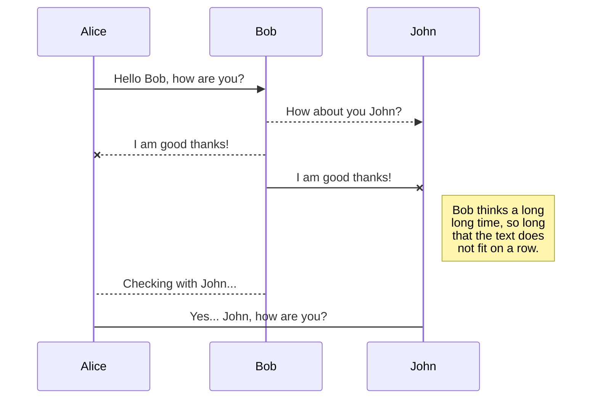
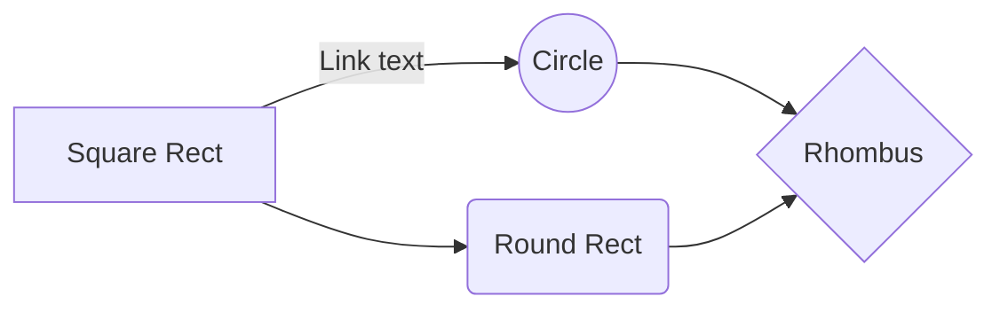

This project was bootstrapped with [Create React App](https://github.com/facebook/create-react-app).

## Available Scripts

In the project directory, you can run:

### `npm start`

Runs the app in the development mode. 
Open [http://localhost:3000](http://localhost:3000) to view it in the browser.

The page will reload if you make edits. 
You will also see any lint errors in the console.

### `npm test`

Launches the test runner in the interactive watch mode. 
See the section about [running tests](https://facebook.github.io/create-react-app/docs/running-tests) for more information.

### `npm run build`

Builds the app for production to the `build` folder. 
It correctly bundles React in production mode and optimizes the build for the best performance.

The build is minified and the filenames include the hashes. 
Your app is ready to be deployed!

See the section about [deployment](https://facebook.github.io/create-react-app/docs/deployment) for more information.

### `npm run eject`

**Note: this is a one-way operation. Once you `eject`, you can’t go back!**

If you aren’t satisfied with the build tool and configuration choices, you can `eject` at any time. This command will remove the single build dependency from your project.

Instead, it will copy all the configuration files and the transitive dependencies (webpack, Babel, ESLint, etc) right into your project so you have full control over them. All of the commands except `eject` will still work, but they will point to the copied scripts so you can tweak them. At this point you’re on your own.

You don’t have to ever use `eject`. The curated feature set is suitable for small and middle deployments, and you shouldn’t feel obligated to use this feature. However we understand that this tool wouldn’t be useful if you couldn’t customize it when you are ready for it.

## Learn More

You can learn more in the [Create React App documentation](https://facebook.github.io/create-react-app/docs/getting-started).

To learn React, check out the [React documentation](https://reactjs.org/).

### Code Splitting

This section has moved here: https://facebook.github.io/create-react-app/docs/code-splitting

### Analyzing the Bundle Size

This section has moved here: https://facebook.github.io/create-react-app/docs/analyzing-the-bundle-size

### Making a Progressive Web App

This section has moved here: https://facebook.github.io/create-react-app/docs/making-a-progressive-web-app

### Advanced Configuration

This section has moved here: https://facebook.github.io/create-react-app/docs/advanced-configuration

### Deployment

This section has moved here: https://facebook.github.io/create-react-app/docs/deployment

### `npm run build` fails to minify

This section has moved here: https://facebook.github.io/create-react-app/docs/troubleshooting#npm-run-build-fails-to-minify

### Deploying to docker and Elastic Beanstalk
# Welcome to StackEdit!

Hi! I'm your first Markdown file in **StackEdit**. If you want to learn about StackEdit, you can read me. If you want to play with Markdown, you can edit me. Once you have finished with me, you can create new files by opening the **file explorer** on the left corner of the navigation bar.

# Files

StackEdit stores your files in your browser, which means all your files are automatically saved locally and are accessible **offline!**

## Create files and folders

The file explorer is accessible using the button in left corner of the navigation bar. You can create a new file by clicking the **New file** button in the file explorer. You can also create folders by clicking the **New folder** button.

## Switch to another file

All your files and folders are presented as a tree in the file explorer. You can switch from one to another by clicking a file in the tree.

## Rename a file

You can rename the current file by clicking the file name in the navigation bar or by clicking the **Rename** button in the file explorer.

## Delete a file

You can delete the current file by clicking the **Remove** button in the file explorer. The file will be moved into the **Trash** folder and automatically deleted after 7 days of inactivity.

## Export a file

You can export the current file by clicking **Export to disk** in the menu. You can choose to export the file as plain Markdown, as HTML using a Handlebars template or as a PDF.

# Synchronization

Synchronization is one of the biggest features of StackEdit. It enables you to synchronize any file in your workspace with other files stored in your **Google Drive**, your **Dropbox** and your **GitHub** accounts. This allows you to keep writing on other devices, collaborate with people you share the file with, integrate easily into your workflow... The synchronization mechanism takes place every minute in the background, downloading, merging, and uploading file modifications.

There are two types of synchronization and they can complement each other:

- The workspace synchronization will sync all your files, folders and settings automatically. This will allow you to fetch your workspace on any other device.
	> To start syncing your workspace, just sign in with Google in the menu.

- The file synchronization will keep one file of the workspace synced with one or multiple files in **Google Drive**, **Dropbox** or **GitHub**.
	> Before starting to sync files, you must link an account in the **Synchronize** sub-menu.

## Open a file

You can open a file from **Google Drive**, **Dropbox** or **GitHub** by opening the **Synchronize** sub-menu and clicking **Open from**. Once opened in the workspace, any modification in the file will be automatically synced.

## Save a file

You can save any file of the workspace to **Google Drive**, **Dropbox** or **GitHub** by opening the **Synchronize** sub-menu and clicking **Save on**. Even if a file in the workspace is already synced, you can save it to another location. StackEdit can sync one file with multiple locations and accounts.

## Synchronize a file

Once your file is linked to a synchronized location, StackEdit will periodically synchronize it by downloading/uploading any modification. A merge will be performed if necessary and conflicts will be resolved.

If you just have modified your file and you want to force syncing, click the **Synchronize now** button in the navigation bar.

> **Note:** The **Synchronize now** button is disabled if you have no file to synchronize.

## Manage file synchronization

Since one file can be synced with multiple locations, you can list and manage synchronized locations by clicking **File synchronization** in the **Synchronize** sub-menu. This allows you to list and remove synchronized locations that are linked to your file.

# Publication

Publishing in StackEdit makes it simple for you to publish online your files. Once you're happy with a file, you can publish it to different hosting platforms like **Blogger**, **Dropbox**, **Gist**, **GitHub**, **Google Drive**, **WordPress** and **Zendesk**. With [Handlebars templates](http://handlebarsjs.com/), you have full control over what you export.

> Before starting to publish, you must link an account in the **Publish** sub-menu.

## Publish a File

You can publish your file by opening the **Publish** sub-menu and by clicking **Publish to**. For some locations, you can choose between the following formats:

- Markdown: publish the Markdown text on a website that can interpret it (**GitHub** for instance),
- HTML: publish the file converted to HTML via a Handlebars template (on a blog for example).

## Update a publication

After publishing, StackEdit keeps your file linked to that publication which makes it easy for you to re-publish it. Once you have modified your file and you want to update your publication, click on the **Publish now** button in the navigation bar.

> **Note:** The **Publish now** button is disabled if your file has not been published yet.

## Manage file publication

Since one file can be published to multiple locations, you can list and manage publish locations by clicking **File publication** in the **Publish** sub-menu. This allows you to list and remove publication locations that are linked to your file.

# Markdown extensions

StackEdit extends the standard Markdown syntax by adding extra **Markdown extensions**, providing you with some nice features.

> **ProTip:** You can disable any **Markdown extension** in the **File properties** dialog.

## SmartyPants

SmartyPants converts ASCII punctuation characters into "smart" typographic punctuation HTML entities. For example:

|                |ASCII                          |HTML                         |
|----------------|-------------------------------|-----------------------------|
|Single backticks|`'Isn't this fun?'`            |'Isn't this fun?'            |
|Quotes          |`"Isn't this fun?"`            |"Isn't this fun?"            |
|Dashes          |`-- is en-dash, --- is em-dash`|-- is en-dash, --- is em-dash|

## KaTeX

You can render LaTeX mathematical expressions using [KaTeX](https://khan.github.io/KaTeX/):

The *Gamma function* satisfying $\Gamma(n) = (n-1)!\quad\forall n\in\mathbb N$ is via the Euler integral

$$
\Gamma(z) = \int_0^\infty t^{z-1}e^{-t}dt\,.
$$

> You can find more information about **LaTeX** mathematical expressions [here](http://meta.math.stackexchange.com/questions/5020/mathjax-basic-tutorial-and-quick-reference).

## UML diagrams

You can render UML diagrams using [Mermaid](https://mermaidjs.github.io/). For example, this will produce a sequence diagram:

And this will produce a flow chart:

## Docker/Docker Hub

**Prerequisites: A Docker Account, Installation of Docker**

**Create Dockerfile in project root directory with the following:**

Change the node version to match the version installed on your machine

`FROM node:12.16.3  as build  `
`RUN mkdir /usr/src/app  `
`WORKDIR /usr/src/app  `
`ENV PATH /usr/src/app/node_modules/.bin:$PATH  `
`COPY package.json /usr/src/app/package.json  `
`RUN npm install --silent  `
`RUN npm install react-scripts -g --silent  `
`COPY . /usr/src/app  `
`RUN npm run build  `
`FROM nginx:1.13.12-alpine  `
`COPY --from=build /usr/src/app/build /usr/share/nginx/html  `
`EXPOSE <portNumber>  `
`CMD ["nginx", "-g", "daemon off;"]`

  

**Create .dockerignore file in the root directory with the following:**

  

`node_modules`
`npm-debug.log  `
`.git  `
`.gitignore`

**Build Docker using terminal or command line:**

`docker build -t <ContainerName> <projectDirectory>`

**Run docker to test if the container works:**

`docker run -it -p 8081:<portNumber> <ContainerName>`

  
  
  
  
  
**Push docker image to Docker Hub**

Log into [https://hub.docker.com/](https://hub.docker.com/) and then click ‘create repository’

**Log in to Docker from terminal or command line**

`docker login --username=yourHubUsername --email=youremail@company.com`

  

**Find docker Image with the previously set container name**

  

`docker images`

  
  

**Tag the Image**

`Docker tag <IMAGE ID> <yourHubUsername>/<repositoryName>:<yourTag>`

**Push image to docker**

  

`docker push <yourHubUsername>/<dockerHubRepository>`

  

## AWS IAM

Create a new AWS IAM Role to provide EC2 access to the above S3 bucket. Create the IAM role for the EC2 Use case and provide AmazonS3FullAccess ([https://www.youtube.com/watch?v=pLw6MLqwmew](https://www.youtube.com/watch?v=pLw6MLqwmew))

  

  

  

## AWS Elastic Beanstalk

  
  

Create ‘Dockerrun.aws.json’ file in project root directory with the following:

  

`{`

`"AWSEBDockerrunVersion": "1",`

`"Image": {`

`"Name": "<dockerUsername>/<repositoryName>:<tag>",`

`"Update": "true"`

`},`

`"Authentication":{`

`"Bucket": "<nameOfS3Bucket>",`

`"Key": "config.json"`

`},`

`"Ports": [`

`{`

`"ContainerPort": "80"`

`}`

`]`

`}`

  
  

**Find the config.json file in the .docker directory and upload to S3 bucket [create a new bucket or use an existing one]**

*For windows config.json can be found in ‘C:\Users\<yourUsername>\.docker’*

*For MacOS config.json can be found in ‘/Users/<yourUsername>/.docker’*

*(press command+shift+. To display hidden folders)*

  

**Create a new Elastic Beanstalk Application**

-   Enter an Application name
    
-   Pick Docker as the Platform
    
-   Select ‘Upload your code’
    
-   Upload the Dockerrun.aws.json file
    
-   Select ‘Configure more options’
    
-   Edit Security
    
-   Add the previously created IAM Role in the IAM instance profile option under the Virtual Machine permissions section
    
-   Click ‘Save’
    
-   Click ‘Create environment’